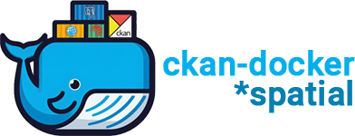

<p align="center">
  <picture>
    
  </picture>
</p>
<h1 align="center">CKAN Docker Compose - Open Data & GIS</h1>
<p align="center">
<a href="https://github.com/mjanez/ckan-docker"></a>

<p align="center">
    <a href="#overview">Overview</a> •
    <a href="#ckan-docker-roadmap">Branch roadmap</a> •
    <a href="#environment-docker">Environment: docker</a> •
    <a href="#install-build-and-run-ckan-plus-dependencies">Install CKAN</a> •
    <a href="#ckan-images">CKAN images</a> •   
    <a href="#extending-the-base-images">Extending guide</a> •
    <a href="#applying-patches">Applying patches</a> •
    <a href="#ckan-docker-addons">Addons</a> •
    <a href="#ckan-docker-tips">Info & Backups</a> • 
    <a href="#ckan-api">API</a>
</p>

**Requirements**:
* [Docker](https://docs.docker.com/get-docker/)

## Overview
Contains Docker images for the different components of CKAN Cloud and a Docker compose environment (based on [ckan](https://github.com/ckan/ckan)) for development and testing Open Data portals.


> [!TIP]
>* Use the **[deploy in 5 minutes](#quick-mode)** to see `ckan-docker` in **5 minutes ⏱**!
>* Or use [Codespaces](https://github.com/features/codespaces) to test `ckan-docker` in your browser:
> <center><a href='https://codespaces.new/mjanez/ckan-docker'></a></center>

> [!IMPORTANT]
>This is a **custom installation of Docker Compose** with specific extensions for spatial data and [GeoDCAT-AP](https://github.com/SEMICeu/GeoDCAT-AP)/[INSPIRE](https://github.com/INSPIRE-MIF/technical-guidelines) metadata [profiles](https://en.wikipedia.org/wiki/Geospatial_metadata). For official installations, please have a look: [CKAN documentation: Installation](https://docs.ckan.org/en/latest/maintaining/installing/index.html).


Available components:
* CKAN custom multi-stage build with spatial capabilities from [ckan-docker-spatial](https://github.com/mjanez/ckan-docker-spatial)[^1], an image used as a base and built from the official CKAN repo. The following versions of CKAN are available:

| CKAN Version | Type |  Base image | Docker tag | Notes |
| --- | --- | --- | --- | --- |
| 2.9.x  | custom spatial image | `alpine:3.15` | `ghcr.io/mjanez/ckan-spatial:ckan-2.9.8`, `ghcr.io/mjanez/ckan-spatial:ckan-2.9.8`,  `ghcr.io/mjanez/ckan-docker:ckan-2.9.9`, `ghcr.io/mjanez/ckan-docker:ckan-2.9.10`, `ghcr.io/mjanez/ckan-docker:ckan-2.9.11`, `ghcr.io/mjanez/ckan-docker:2.9.12` | Stable official versions of CKAN `2.9.8`, `2.9.10` and `2.9.11`, including a security backport: `2.9.12`. As of `2.9.12`, repo images are aligned with the [`ckan-docker-spatial`](https://github.com/mjanez/ckan-docker-spatial#pre-configured-ckan-docker-images) and [`ckan-docker-base](https://github.com/ckan/ckan-docker-base#pre-configured-ckan-docker-images)` tags. |
| 2.10.x  | custom spatial image | `python:3.10-slim-bookworm` | `ghcr.io/mjanez/ckan-docker:2.10.5` | From `2.10` images only [Debian-based official Python images](https://hub.docker.com/_/python) rather than Alpine-based images will be provided. |
| 2.11.x  | custom spatial image | `python:3.10-slim-bookworm` | `ghcr.io/mjanez/ckan-docker:2.11.0` | Latest CKAN version. |

The non-CKAN images are as follows:
* PostgreSQL: [Custom image](/postgresql/Dockerfile) based on official PostgreSQL image. Database files are stored in a named volume.
* Solr: [Custom image](/solr/Dockerfile.spatial) based on official CKAN [pre-configured Solr image](https://github.com/ckan/ckan-solr). The index data is stored in a named volume and has a custom spatial schema upgrades. [^2]
* Redis: Standard Redis image
* NGINX: Latest stable nginx image that includes SSL and Non-SSL endpoints.
* ckan-pycsw: [Custom image](/ckan-pycsw/Dockerfile) based on [pycsw CKAN harvester ISO19139](https://github.com/mjanez/ckan-pycsw) for INSPIRE Metadata CSW Endpoint.

Optional HTTP Endpoint ([`docker-compose.apache.yml`](/docker-compose.apache.yml)):
* `docker-compose.apache.yml`:
  * Apache HTTP Server: [Custom image](/apache/Dockerfile) based on official latest stable httpd image. Configured to serve multiple routes for the [ckan-pycsw](#ckan-pycsw) CSW endpoint (`{CKAN_SITE_URL}/csw`) and CKAN (`{CKAN_SITE_URL}/catalog`). Only HTTP.

| Compose files | Repository | Type | Docker tag | Size | Notes |
| --- | --- | --- | --- | --- | --- |
| [`docker-compose.yml`](/docker-compose.yml) / [`docker-compose.apache.yml`](/docker-compose.apache.yml) | CKAN 2.9.11 | custom image | [`mjanez/ckan-docker:ckan-2.9.11`](https://github.com/mjanez/ckan-docker/pkgs/container/ckan-docker) | 800 MB |   Custom Dockerfile: [`ckan/Dockerfile`](/ckan/Dockerfile) |
| [`docker-compose.yml`](/docker-compose.yml) / [`docker-compose.apache.yml`](/docker-compose.apache.yml) | PostgreSQL 15 | base image | [`postgres/postgres:15-alpine`](https://hub.docker.com/layers/library/postgres/15-alpine/images/sha256-53a02ecbe9d18ff6476e6651c34811da39f054424c725fc15d2b480fc3fab877?context=explore) | 89.74 MB |   Custom Dockerfile: [`postgresql/Dockerfile`](/postgresql/Dockerfile) |
| [`docker-compose.yml`](/docker-compose.yml) / [`docker-compose.apache.yml`](/docker-compose.apache.yml) | Solr 9 | custom image | [`ckan/ckan-solr:2.9-solr9-spatial`](https://registry.hub.docker.com/layers/ckan/ckan-solr/2.9-solr9-spatial/images/sha256-b5ee4979891c7dd1f10d2ac2cbdd4d80ff656879edb0f0493616be7b4cf8bc3a?context=explore) | 331.1 MB |  CKAN's [pre-configured spatial Solr image](https://github.com/ckan/ckan-solr). |
| [`docker-compose.yml`](/docker-compose.yml) / [`docker-compose.apache.yml`](/docker-compose.apache.yml) | Redis 7 | base image | [`redis/redis:7-alpine`](https://hub.docker.com/layers/library/redis/7-alpine/images/sha256-98f4ea44e912d0941d29015a4e2448151b94411109c896b5627d94d79306eea7?context=explore) | 11.82 MB |  - |
| [`docker-compose.yml`](/docker-compose.yml) | Apache HTTP Server 2.4 | custom image | [`httpd/httpd:2.4`](https://hub.docker.com/layers/library/httpd/2.4/images/sha256-f34e8e25ee18da020633ef0b2bf7516d8cfdad5c5c4b0595d36e5cd78a098101?context=explore) | 54.47 MB |  Custom Dockerfile: [`apache/Dockerfile`](/apache/Dockerfile) |
| [`docker-compose.yml`](/docker-compose.yml)| pycsw CKAN harvester ISO19139 | custom image | [`mjanez/ckan-pycsw:latest`](https://github.com/mjanez/ckan-pycsw/pkgs/container/ckan-pycsw) | 175 MB |  Custom Dockerfile: [`ckan-pycsw/Dockerfile`](/ckan-pycsw/Dockerfile) |
| [`docker-compose.apache.yml`](/docker-compose.apache.yml) | NGINX stable | base image | [`nginx:stable-alpine`](https://hub.docker.com/layers/library/nginx/stable-alpine/images/sha256-ff2a5d557ca22fa93669f5e70cfbeefda32b98f8fd3d33b38028c582d700f93a?context=explore) | 9.74 MB | No routing, only CKAN. Custom Dockerfile: [`nginx/Dockerfile`](/nginx/Dockerfile) |


The site is configured using environment variables that you can set in the `.env` file for an NGINX and ckan-pycsw deployment (default `.env.example`), or replace it with the [`.env.apache.example`](/samples/.env.apache.example) for a Apache HTTP Server deployment using the Docker Compose file: [`docker-compose.apache.yml`](/docker-compose.apache.yml).


### ckan-docker roadmap
Information about extensions installed in the `main` image. More info described in the [Extending the base images](#extending-the-base-images)

> [!NOTE]
> Switch branches to see the `roadmap` for other projects: [ckan-docker/branches](https://github.com/mjanez/ckan-docker/branches)


| **Element** | **Description**                                                                         | **version** | **Status**                   | **DEV**[^3] | **PRO**[^4]  | **Remarks**                                                                                                                                                                                                                                                                                                                                                             |
|-------------|-----------------------------------------------------------------------------------------|-------------|------------------------------|---------|---------|-------------------------------------------------------------------------------------------------------------------------------------------------------------------------------------------------------------------------------------------------------------------------------------------------------------------------------------------------------------------------|
| Core        | [CKAN](https://github.com/mjanez/ckan-docker)                                           | 2.9.11      | Completed                    | ✔️      | ✔️      | Stable installation for version 2.9.11 (Production & Dev images) via Docker Compose based on [official images](https://github.com/ckan/ckan-docker-base)). Initial configuration, basic customisation and operation guide.                                                                                                                                              |
| Core +      | [Datastore](https://github.com/mjanez/ckan-docker)                                      | 2.9.11      | Completed                    | ✔️      | ✔️      | Stable installation (Production & Dev images) via Docker Compose.                                                                                                                                                                                                                                                                                                       |
| Core +      | [~~Datapusher~~](https://github.com/mjanez/ckan-docker)                                     | 0.0.19      | Deprecated                    | ❌      | ❌      | Updated to [xloader](https://github.com/ckan/ckanext-xloader), an express Loader - quickly load data into DataStore.                                                                                                                                |
| Extension   | [ckanext-xloader](https://github.com/ckan/ckanext-xloader)                              | 1.0.1        | Completed                    | ✔️      | ✔️      | Stable installation, a replacement for DataPusher because it offers ten times the speed and more robustness                                                                                                                                                                                                                                                                  |
| Extension   | [ckanext-harvest](https://github.com/ckan/ckanext-harvest)                              | v1.5.6       | Completed                    | ✔️      | ✔️      | Stable installation, necessary for the implementation of the Collector ([ogc_ckan](#recollector-ckan))                                                                                                                                                                                                                                                                  |
| Extension   | [ckanext-geoview](https://github.com/ckan/ckanext-geoview)                              | 0.0.20      | Completed                    | ✔️      | ✔️      | Stable installation.                                                                                                                                                                                                                                                                                                                                                    |
| Extension   | [ckanext-spatial](https://github.com/ckan/ckanext-spatial)                              | 2.0.0       | Completed                    | ✔️      | ✔️      | Stable installation, necessary for the implementation of the Collector ([ogc_ckan](#recollector-ckan))                                                                                                                                                                                                                                                                  |
| Extension   | [ckanext-dcat](https://github.com/mjanez/ckanext-dcat)                                  | 1.1.0       | Completed                    | ✔️      | ✔️      | Stable installation, include DCAT-AP 2.1 profile compatible with GeoDCAT-AP.                                                                                                                                                                                                                                                                                            |
| Extension   | [ckanext-scheming](https://github.com/mjanez/ckanext-scheming)                          | 3.0.0       | WIP                          | ✔️      | ✔️      | Stable installation. Customised ckanext schema[^5] based on the [Spanish Metadata Core](https://datos.gob.es/es/doc-tags/nti-risp) with the aim of completing the minimum metadata elements included in the current datasets in accordance with [GeoDCAT-AP](https://semiceu.github.io/GeoDCAT-AP/releases/) and [INSPIRE](https://inspire.ec.europa.eu/about-inspire). |
| Extension   | [ckanext-resourcedictionary](https://github.com/OpenDataGIS/ckanext-resourcedictionary) | v1.0.1        | Completed                    | ✔️      | ✔️      | Stable installation. This extension extends the default CKAN Data Dictionary functionality by adding possibility to create data dictionary before actual data is uploaded to datastore.                                                                                                                                                                                 |
| Extension   | [ckanext-pages](https://github.com/ckan/ckanext-pages)                                  | 0.5.2       | Completed                    | ✔️      | ✔️      | Stable installation. This extension gives you an easy way to add simple pages to CKAN.                                                                                                                                                                                                                                                                                  |
| Extension   | [ckanext-pdfview](https://github.com/ckan/ckanext-pdfview)                              | 0.0.8       | Completed                    | ✔️      | ✔️      | Stable installation. This extension provides a view plugin for PDF files using an html object tag.                                                                                                                                                                                                                                                                      |
| Extension    | [ckanext-schemingdcat](https://github.com/mjanez/ckanext-schemingdcat)                                    | 2.0.0        | Completed | ✔️      | ✔️       | Stable installation for version 1.2.0, provides functions and templates specifically designed to extend [ckanext-scheming](https://github.com/mjanez/ckanext-scheming) and includes DCAT enhancements to adapt CKAN schema to GeoDCAT-AP and several improvements such as multilang for datasets, orgs and groups or new theming.                                                                                                                                       |
| Extension    | [ckanext-fluent](https://github.com/mjanez/ckanext-fluent)                                    | 1.0.1        | Completed | ✔️      | ✔️       | Multilingual fields for CKAN, stable version.                                                                                                                                            |
| Software    | [ckan-pycsw](https://github.com/mjanez/ckan-pycsw)                                    | main        | Completed | ✔️      | ✔️       | Stable installation. PyCSW Endpoint of Open Data Portal with docker compose config. Harvest the CKAN catalogue in a CSW endpoint based on existing spatial datasets in the open data portal.                                                                                                                                                                            |


## Environment: docker
### docker compose *vs* docker-compose
All Docker Compose commands in this README will use the V2 version of Compose ie: `docker compose`. The older version (V1) used the `docker-compose` command. Please see [Docker Compose](https://docs.docker.com/compose/compose-v2/) for
more information.

### Install docker-engine
Follow the [installation instructions](https://docs.docker.com/get-docker/) for your environment to install Docker Engine.

To verify a successful Docker installation, run `docker run hello-world` and `docker version`. These commands should output 
versions for client and server.

> [!NOTE]
> Learn more about [Docker/Docker Compose](#docker-basic-commands) basic commands.


## Install (build and run) CKAN plus dependencies
### Clone and configure
Before starting the deployment, you'll need to set up a `.env` file. This file is crucial as it contains environment variables that the application needs to run properly. These variables include site urls, credentials, API keys, and other configuration details that should not be hard-coded into the application's source code for security reasons.

1. Clone project
    ```shell
    cd /path/to/my/project
    git clone https://github.com/mjanez/ckan-docker.git & cd ckan-docker
    ```

2. Copy the `.env.example` template (or use another from [`/samples/`](/samples/)) and modify the resulting `.env` to suit your needs.

    ```shell
    cp .env.example .env
    ```

    - **NGINX**: Host ports: (`NGINX_PORT_HOST` and `NGINX_SSLPORT_HOST`)
    - **Apache HTTP Server**: Host ports: (`APACHE_PORT_HOST`)

    Then modify the variables about the site URL or locations (`CKAN_SITE_URL`, `CKAN_URL`, `PYCSW_URL`, `CKANEXT__DCAT__BASE_URI`, `PROXY_SERVER_NAME`, `PROXY_CKAN_LOCATION`, `PROXY_PYCSW_LOCATION`, etc.) using the port hosts above.

> [!NOTE]
> Please note that when accessing CKAN directly (via a browser) ie: not going through Apache/NGINX you will need to make sure you have "ckan" set up to be an alias to localhost in the local hosts file. Either that or you will need to change the `.env` entry for `CKAN_SITE_URL`
> For more information about the `.env' file, see [.env docs](./doc/info_envfile.md)

> [!WARNING]
> Using the default values on the `.env` file will get you a working CKAN instance. There is a sysadmin user created by default with the values defined in `CKAN_SYSADMIN_NAME` and `CKAN_SYSADMIN_PASSWORD` (`ckan_admin` and `test1234` by default). All envvars with `API_TOKEN` are automatically regenerated when CKAN is loaded, no editing is required.
> 
>**This should be obviously changed before running this setup as a public CKAN instance.**

You are now ready to proceed with deployment.

### Base mode
Use this if you are a maintainer and will not be making code changes to CKAN or to CKAN extensions.

1. Build the images:
    ```bash
    docker compose build 
    ```

> [!NOTE]
> You can use a [deploy in 5 minutes](#quick-mode) if you just want to test the package. 

2. Start the containers:
    ```bash
    docker compose up
    ```

This will start up the containers in the current window. By default the containers will log direct to this window with each container
using a different colour. You could also use the -d "detach mode" option ie: `docker compose up -d` if you wished to use the current 
window for something else.

> [!NOTE]
> * Or `docker compose up --build` to build & up the containers.
> * Or `docker compose -f docker-compose.apache.yml up -d --build` to use the Apache HTTP Server version.

> [!NOTE]
> Learn more about configuring this ckan docker: 
> - [Backup the CKAN Database](#ckan-backups)
> - [Configuring a docker compose service to start on boot](#docker-compose-configure-a-docker-compose-service-to-start-on-boot)

At the end of the container start sequence there should be 6 containers running.

After this step, CKAN should be running at `http://{PROXY_SERVER_NAME}/{PROXY_CKAN_LOCATION}` and ckan-pycsw at `http://{PROXY_SERVER_NAME}/{PROXY_PYCSW_LOCATION}`, i.e: http://localhost/catalog or http://localhost/csw

| CONTAINER   ID | IMAGE                                | COMMAND              | CREATED            | STATUS                      | PORTS                                           | NAMES                                    |
|----------------|--------------------------------------|----------------------|--------------------|-----------------------------|-------------------------------------------------|------------------------------------------|
| 0217537f717e   | ckan-docker-nginx/ckan-docker-apache | /docker-entrypoint.… | 6      minutes ago | Up   4    minutes           | 80/tcp,0.0.0.0:80->80/tcp,0.0.0.0:8443->443/tcp | ckan-docker-nginx-1/ckan-docker-apache-1 |
| 7b06ab2e060a   | ckan-docker-ckan                     | /srv/app/start_ckan… | 6      minutes ago | Up   5    minutes (healthy) | 0.0.0.0:5000->5000/tcp                          | ckan-docker-ckan-1                       |
| 1b8d9789c29a   | redis:7-alpine                       | docker-entrypoint.s… | 6      minutes ago | Up   4    minutes (healthy) | 6379/tcp                                        | ckan-docker-redis-1                      |
| 7f162741254d   | ckan/ckan-solr:2.9-solr9-spatial     | docker-entrypoint.s… | 6      minutes ago | Up   4    minutes (healthy) | 8983/tcp                                        | ckan-docker-solr-1                       |
| 2cdd25cea0de   | ckan-docker-db                       | docker-entrypoint.s… | 6      minutes ago | Up   4    minutes (healthy) | 5432/tcp                                        | ckan-docker-db-1                         |
| 9cdj25dae6gr   | ckan-docker-pycsw                    | docker-entrypoint.s… | 6      minutes ago | Up   4    minutes (healthy) | 8000/tcp                                        | ckan-docker-pycsw-1                      |


### Quick mode
If you just want to test the package and see the general functionality of the platform, you can use the `ckan-docker` image from the [Github container registry](https://github.com/mjanez/ckan-docker/pkgs/container/ckan-docker):
    
  ```bash
  # Edit the envvars in the .env as you like and start the containers.
  docker compose -f docker-compose.ghcr.yml up -d --build 
  ```

> [!NOTE]
>It will download the pre-built image and deploy all the containers. Remember to use your own domain by changing `localhost` in the `.env` file.


### Development mode
Use this mode if you are making code changes to CKAN and either creating new extensions or making code changes to existing extensions. This mode also uses the `.env` file for config options.

To develop local extensions use the `docker compose.dev.yml` file:

To build the images:
    ```bash
	docker compose -f docker-compose.dev.yml build
    ```

To start the containers:
    ```bash
	docker compose -f docker-compose.dev.yml up
    ```

See [CKAN images](#ckan-images) for more details of what happens when using development mode.

> [!TIP]
> To enable the [Flask tool console](https://flask.palletsprojects.com/en/2.3.x/debugging/#debugging-application-errors), you need to enable tool debugging mode. This is done by setting the tool logging level to `DEBUG` in the CKAN configuration file, `ckan.ini`. Here is the code snippet you need to add to your `ckan.ini` file:
> ```ini
> [logger_werkzeug]
> level = DEBUG
>```

#### Create an extension
You can use the ckan [extension](https://docs.ckan.org/en/latest/extensions/tutorial.html#creating-a-new-extension) instructions to create a CKAN extension, only executing the command inside the CKAN container and setting the mounted `src/` folder as output:

  ```bash
  docker compose -f docker-compose.dev.yml exec ckan-dev /bin/sh -c "ckan -c /srv/app/ckan.ini generate extension --output-dir /srv/app/src_extensions"
  ```

Then, answer the prompts to configure the plugin:

  ```bash
  Extension's name [must begin 'ckanext-']: ckanext-newextension
  Author's name []: Joe Bloggs
  Author's email []: joe@bloggs.com
  Your Github user or organization name []: joebloggs
  Brief description of the project []: test creating a new extension
  List of keywords (separated by spaces) [CKAN]: ckanext-newextension
  Do you want to include code examples? [y/N]: y

  Written: /srv/app/src_extensions/ckanext-newextension
  ```

The new extension files and directories are created in the `/srv/app/src_extensions/` folder in the running container. They will also exist in the local src/ directory as local `/src` directory is mounted as `/srv/app/src_extensions/` on the ckan container. You might need to change the owner of its folder to have the appropiate permissions.

#### Running HTTPS on development mode
Sometimes is useful to run your local development instance under HTTPS, for instance if you are using authentication extensions like [ckanext-saml2auth](https://github.com/keitaroinc/ckanext-saml2auth). To enable it, set the following in your `.env` file:

  ```ini
    USE_HTTPS_FOR_DEV=true
  ```

and update the site URL setting:

  ```ini
    CKAN_SITE_URL=https://localhost:5000
  ```

After recreating the `ckan-dev` container, you should be able to access CKAN at https://localhost:5000

## CKAN images


The Docker image config files used to build your CKAN project are located in the `ckan/` folder. There are two Docker files:

* `Dockerfile`: this is based on `mjanez/ckan-base-spatial:<version>`, a base image located in the [Github Package Registry](https://github.com/mjanez/ckan-docker/pkgs/container/ckan-base-spatial), that has CKAN installed along with all its dependencies, properly configured and running on [uWSGI](https://uwsgi-docs.readthedocs.io/en/latest/) (production setup)
* `Dockerfile.dev`:  this is based on `mjanez/ckan-base-spatial:<version>-dev` also located located in the Github Package Registry, and extends `mjanez/ckan-base-spatial:<version>` to include:

  * Any extension cloned on the `./src` folder will be installed in the CKAN container when booting up Docker Compose (`docker compose -f docker-compose.dev.yml up`). This includes installing any requirements listed in a `requirements.txt` (or `pip-requirements.txt`) file and running `python setup.py develop`. You can clone all the extensions explained in [`src/README`](/src/README.md) with their tag, reqs and autocrlf using a bash script.
  * CKAN is started running this: `/usr/bin/ckan -c /srv/app/ckan.ini run -H 0.0.0.0`.
  * Make sure to add the local plugins to the `CKAN__PLUGINS` env var in the `.env` file.

* Any custom changes to the scripts run during container start up can be made to scripts in the `setup/` directory. For instance if you wanted to change the port on which CKAN runs you would need to make changes to the Docker Compose yaml file, and the `start_ckan.sh.override` file. Then you would need to add the following line to the Dockerfile ie: `COPY setup/start_ckan.sh.override ${APP_DIR}/start_ckan.sh`. The `start_ckan.sh` file in the locally built image would override the `start_ckan.sh` file included in the base image

> [!TIP] 
> If you get an error like ` doesn't have execute permissions`: 
>
>```log
>Daemon error response: failed to create shim task: OCI runtime create failed: runc create failed: unable to start container process: exec: "/srv/app/start_ckan.sh": permission denied: unknown
>```
>
>It may be necessary to give execute permissions to the file in the `Dockerfile`:
>
>```dockerfile
>...
># Override start_ckan.sh
>COPY setup/start_ckan.sh.override ${APP_DIR}/start_ckan.sh
>RUN chmod +x ${APP_DIR}/start_ckan.sh
>...
>```


## CKAN images enhancement
### Extending the base images
You can modify the docker files to build your own customized image tailored to your project, installing any extensions and extra requirements needed. For example here is where you would update to use a different CKAN base image ie: `ckan/ckan-base-spatial:<new version>`

To perform extra initialization steps you can add scripts to your custom images and copy them to the `/docker-entrypoint.d` folder (The folder should be created for you when you build the image). Any `*.sh` and `*.py` file in that folder will be executed just after the main initialization script ([`prerun.py`](https://github.com/ckan/ckan-docker-base/blob/main/ckan-2.9/base/setup/prerun.py)) is executed and just before the web server and supervisor processes are started.

For instance, consider the following custom image:

```bash
ckan
├── docker-entrypoint.d
│   └── setup_validation.sh
├── Dockerfile
└── Dockerfile.dev
```

We want to install an extension like [ckanext-validation](https://github.com/frictionlessdata/ckanext-validation) that needs to create database tables on startup time. We create a `setup_validation.sh` script in a `docker-entrypoint.d` folder with the necessary commands:

```bash
#!/bin/bash

# Create DB tables if not there
ckan -c /srv/app/ckan.ini validation init-db 
```

And then in our `Dockerfile.dev` file we install the extension and copy the initialization scripts:

```Dockerfile
FROM ckan/ckan-base-spatial:2.9.11

RUN pip install -e git+https://github.com/frictionlessdata/ckanext-validation.git#egg=ckanext-validation && \
    pip install -r https://raw.githubusercontent.com/frictionlessdata/ckanext-validation/master/requirements.txt

COPY docker-entrypoint.d/* /docker-entrypoint.d/
```
> [!TIP]
>There are a number of extension examples commented out in the [`Dockerfile.dev`](https://github.com/mjanez/ckan-docker/blob/master/ckan/Dockerfile.dev) file

### Applying patches
When building your project specific CKAN images (the ones defined in the `ckan/` folder), you can apply patches 
to CKAN core or any of the built extensions. To do so create a folder inside `ckan/patches` with the name of the
package to patch (ie `ckan` or `ckanext-??`). Inside you can place patch files that will be applied when building
the images. The patches will be applied in alphabetical order, so you can prefix them sequentially if necessary.

For instance, check the following example image folder:

```bash
ckan
├── patches
│   ├── ckan
│   │   ├── 01_datasets_per_page.patch
│   │   ├── 02_groups_per_page.patch
│   │   ├── 03_or_filters.patch
│   └── ckanext-harvest
│       └── 01_resubmit_objects.patch
├── setup
├── Dockerfile
└── Dockerfile.dev
```

> [!NOTE]
> Git diff is a command to output the changes between two sources inside the Git repository. The data sources can be two different branches, commits, files, etc.
> * Show changes between working directory and staging area:
>   `git diff > [file.patch]`
> * Shows any changes between the staging area and the repository:
>   `git diff --staged [file]`

#### Applying patches in dev mode
To apply patches in development mode, you would need to follow these steps:

1. Ensure that your patches are placed in the [`ckan/patches`](/ckan/patches/) directory. The patches should be organized into subdirectories named after the package they are intended to patch (e.g., `ckan` or `ckanext-??`). Each patch file should end with the .patch extension.

    For example, your directory structure might look like this:

    ```bash
    ckan
    ├── patches
    │   ├── ckan
    │   │   ├── 01_datasets_per_page.patch
    │   │   ├── 02_groups_per_page.patch
    │   │   ├── 03_or_filters.patch
    │   └── ckanext-harvest
    │       └── 01_resubmit_objects.patch
    ├── setup
    ├── Dockerfile
    └── Dockerfile.dev
    ```

2. Navigate to the [`/src`](/src/) directory.

3. Apply the patches using the patch command:

    ```bash
    find /path/to/ckan/patches -name '*.patch' -exec patch -p1 < {} \;
    ```

    This command will recursively search the `/path/to/ckan/patches` directory for files ending with `.patch` and apply them using the patch command. Replace `/path/to/ckan/patches` with the actual path to your `ckan/patches` directory.

## ckan-docker addons
### Debugging
#### Debugging CKAN Development Instance with VSCode Dev Containers and debugpy

The [Visual Studio Code Dev Containers](https://code.visualstudio.com/docs/devcontainers/containers) extension is a powerful tool that enables developers to use a container as a complete development environment. With this extension, developers can open any folder inside a container and take advantage of the full range of features provided by Visual Studio Code. To do this, developers create a `devcontainer.json `file in their project that specifies how to access or create a development container with a predefined tool and runtime stack. This allows developers to work in an isolated environment, ensuring that the development environment is consistent across team members and that project dependencies are easy to manage.


To set this up:

1. Install [VSCode](https://code.visualstudio.com/).

2. Install the [Remote Development extension](https://marketplace.visualstudio.com/items?itemName=ms-vscode-remote.vscode-remote-extensionpack) for VSCode.

3. In your project directory, create a `devcontainer.json` file. This file will contain the configuration for your development container.

4. In the `devcontainer.json` file, specify the Docker image for your development container and any additional configuration settings, such as environment variables, ports to expose, and startup commands.

5. Enable `debugpy` for your development instance in your `.env` file:

  ```ini
  USE_DEBUGPY_FOR_DEV=true
  ```

6. Start the containers in [development mode](#development-mode) and launch VS Code.

7. Install the "Dev Container" extension: press `CTRL+SHIFT+X`, type "dev container", click "install".

8. Click the `Open a Remote Window` button in the bottom-left of the VS Code window.

9. Click `Attach to Running Container...` and select your ckan-dev container, e.g. `ckan-docker-ckan-dev-1`.

10. Click the `Run and Debug` icon on the left panel then `create a launch.json`, select `Python Debugger`, `Remote Attach`, host `localhost` and port `5678`.

11. Press `F5` or click the `Run` menu and `Start Debugging`.

You can now set breakpoints and remote debug your CKAN development instance using VSCode Dev Containers and debugpy.

#### pdb
Add these lines to the `ckan-dev` service in the docker compose.dev.yml file

```yaml
stdin_open: true
tty: true
```

Debug with pdb (example) - Interact with `docker attach $(docker container ls -qf name=ckan)`

command: `python -m pdb /usr/lib/ckan/venv/bin/ckan --config /srv/app/ckan.ini run --host 0.0.0.0 --passthrough-errors`


### Reverse proxy
#### NGINX
The default Docker Compose configuration ([`docker-compose.yml`](/docker-compose.yml)) uses an NGINX image as the front-end (ie: reverse proxy). It includes HTTPS running on port number 8443 and an HTTP port (81). A "self-signed" SSL certificate is generated beforehand and the server certificate and key files are included. The NGINX `server_name` (ENV: `PROXY_SERVER_NAME`) directive and the `CN` field in the SSL certificate have been both set to 'localhost'. This should obviously not be used for production.

The proxy locations, ports and other NGINX options can be modified in the `.env` file:
```ini
# Host Ports
NGINX_PORT_HOST=81
NGINX_SSLPORT_HOST=8443

# NGINX
NGINX_PORT=80
NGINX_SSLPORT=443
NGINX_LOG_DIR=/var/log/nginx

# Check CKAN__ROOT_PATH and CKANEXT__DCAT__BASE_URI. If you don't need to use domain locations, it is better to use the nginx configuration. Leave blank or use the root `/`.
PROXY_SERVER_NAME=localhost
PROXY_CKAN_LOCATION=/catalog
PROXY_PYCSW_LOCATION=/csw
```
The base Docker Compose configuration uses an NGINX image as the front-end (ie: reverse proxy). It includes HTTPS running on port number 8443. A "self-signed" SSL certificate is generated as part of the ENTRYPOINT. The ENV `PROXY_SERVER_NAME`, NGINX `server_name` directive and the `CN` field in the SSL certificate have been both set to 'localhost'. This should obviously not be used for production.

Creating the SSL cert and key files as follows:
`openssl req -new -newkey rsa:4096 -days 365 -nodes -x509 -subj "/C=DE/ST=Berlin/L=Berlin/O=None/CN=localhost" -keyout ckan-local.key -out ckan-local.crt`
The `ckan-local.*` files will then need to be moved into the nginx/setup/ directory


#### Apache HTTP Server
The Docker Compose configuration ([`docker-compose.apache.yml`](/docker-compose.apache.yml)) uses an httpd image as the front-end. It has two routes for the ckan (default location: `/catalog`) and ckan-pycsw (default location: `/csw`) services. 

The proxy locations, ports and other Apache Web Server options can be modified in the `.env` file:
```ini
# Host Ports
APACHE_PORT_HOST=81

# Apache HTTP Server
APACHE_VERSION=2.4-alpine
APACHE_PORT=80
APACHE_LOG_DIR=/var/log/apache

# Check CKAN__ROOT_PATH and CKANEXT__DCAT__BASE_URI. If you don't need to use domain locations, it is better to use the nginx configuration. Leave blank or use the root `/`.
PROXY_SERVER_NAME=localhost
PROXY_CKAN_LOCATION=/catalog
PROXY_PYCSW_LOCATION=/csw
```


### envvars
The ckanext-envvars extension is used in the CKAN Docker base repo to build the base images.
This extension checks for environmental variables conforming to an expected format and updates the corresponding CKAN config settings with its value.

For the extension to correctly identify which env var keys map to the format used for the config object, env var keys should be formatted in the following way:

  All uppercase  
  Replace periods ('.') with two underscores ('__')  
  Keys must begin with 'CKAN' or 'CKANEXT', if they do not you can prepend them with '`CKAN___`' 

For example:

  * `CKAN__PLUGINS="envvars image_view text_view recline_view datastore datapusher"`
  * `CKAN__DATAPUSHER__CALLBACK_URL_BASE=http://ckan:5000`
  * `CKAN___BEAKER__SESSION__SECRET=CHANGE_ME`

These parameters can be added to the `.env` file 

For more information please see [ckanext-envvars](https://github.com/okfn/ckanext-envvars)

> [!WARNING]
> When deploying under a proxy, such as in a corporate environment, to avoid errors when resolving urls with container_names/hostnames associated with the container on internal networks, use the `no_proxy' variable, in lower case, with the names of the services/containers, the IP of the Docker network, etc.
> e.g: `no_proxy="127.0.0.1,192.168.192.0/23,172.0.0.0/0,redis,solr,${DB_CONTAINER_NAME}"`


## Datastore
The Datastore database and user is created as part of the entrypoint scripts for the db container.


## xloader
This deployment replaces DataPusher with XLoader using Supervisor, more info about other alternatives on the wiki page for this: https://github.com/ckan/ckan-docker/wiki/Replacing-DataPusher-with-XLoader


### ckan-pycsw
[ckan-pycsw](https://github.com/mjanez/ckan-pycsw) is a docker compose environment (based on [pycsw](https://github.com/geopython/pycsw)) for development and testing with CKAN Open Data portals.[^5]

Available components:
* **pycsw**: The pycsw app. An [OARec](https://ogcapi.ogc.org/records) and [OGC CSW](https://opengeospatial.org/standards/cat) server implementation written in Python.
* **ckan2pycsw**: Software to achieve interoperability with the open data portals based on CKAN. To do this, ckan2pycsw reads data from an instance using the CKAN API, generates ISO-19115/ISO-19139 metadata using [pygeometa](https://geopython.github.io/pygeometa/), or a custom schema that is based on a customized CKAN schema, and populates a [pycsw](https://pycsw.org/) instance that exposes the metadata using CSW and OAI-PMH.

### Harvester consumers on a deployed CKAN
[ckanext-harvest supervisor](https://github.com/ckan/ckanext-harvest#setting-up-the-harvesters-on-a-production-server) allows you to harvest metadata from multiple sources on a production deployment. Here it is deployed [by a worker consumers in the `ckan` container](./ckan/setup/workers/harvester.conf), also the `ckanext-harvest` extension and other custom harvesters ([`ckanext-schemingdcat`](https://github.com/mjanez/ckanext-schemingdcat?tab=readme-ov-file#harvesters) or [`ckanext-dcat`](https://github.com/ckan/ckanext-dcat#rdf-dcat-harvester)) are included in the CKAN docker images.

> ![TIP]
> To enable harvesters you need to set up in the `.env` file the `CKAN__PLUGINS` variable with the `harvest` plugin: https://github.com/mjanez/ckan-docker/blob/a18e0c80d9f16b6d9b6471e3148d48fcb83712bd/.env.example#L126-L127


## ckan-docker tips
### CKAN. Backups
PostgreSQL offers the command line tools [`pg_dump`](https://www.postgresql.org/docs/current/static/app-pgdump.html) and [`pg_restore`](https://www.postgresql.org/docs/current/static/app-pgrestore.html) for dumping and restoring a database and its content to/from a file.


#### Backup service for db container
1. Create a new file called `ckan_backup_custom.sh` and open it in your preferred text editor.

2. Add the following code to the script, replacing the placeholders with your actual values:

    ```bash
    #!/bin/bash

    # Set the necessary variables
    CONTAINER_NAME="db"
    DATABASE_NAME="ckandb"
    POSTGRES_USER="postgres"
    POSTGRES_PASSWORD="your_postgres_password"
    BACKUP_DIRECTORY="/path/to/your/backup/directory"
    DATE=$(date +%Y%m%d%H%M%S)
    MONTH=$(date +%m)
    YEAR=$(date +%Y)

    # Create the monthly backup directory if it doesn't exist
    mkdir -p "$BACKUP_DIRECTORY/monthly/$YEAR-$MONTH"

    # Run the backup command
    docker exec -e PGPASSWORD=$POSTGRES_PASSWORD $CONTAINER_NAME pg_dump -U $POSTGRES_USER -Fc $DATABASE_NAME > "$BACKUP_DIRECTORY/monthly/$YEAR-$MONTH/ckan_backup_$DATE.dump"

    # Compress the dump files into a zip archive
    cd "$BACKUP_DIRECTORY/monthly/$YEAR-$MONTH" || exit
    zip "backup_${YEAR}-${MONTH}.zip" *.dump

    # Remove the original dump files
    rm -f *.dump
    ```

3. Replace the following placeholders with your actual values:
    - `your_postgres_password`: The password for the PostgreSQL user.
    - `/path/to/your/backup/directory`: The path to the directory where you want to store the backup files.

    > [!WARNING]
    > If you have changed the values of the PostgreSQL container, database or user, change them too.
    > Check that `zip` package is installed: `sudo apt-get install zip`

4. Save and close the file.

5. Make the script executable:

    ```bash
    chmod +x ckan_backup_custom.sh
    ```

6. Open the crontab for the current user:

    ```bash
    crontab -e
    ```

7. Add the following line to schedule the backup to run daily at midnight (adjust the schedule as needed):

    ```sh
    0 0 * * * /path/to/your/script/ckan_backup_custom.sh
    ```

> [!NOTE]
> Replace `/path/to/your/script` with the actual path to the `ckan_backup_custom.sh` script.
  
8. Save and close the file.

The cronjob is now set up and will backup your CKAN PostgreSQL database daily at midnight using the custom format. The backups will be stored in the specified directory with the timestamp in the filename.

> [!NOTE]
> Sample scripts for backing up CKAN: [`doc/scripts`](doc/scripts)


#### Restore a backup
If need to use a backup, restore it:

1. First clean the database. **Caution, this will delete all data from your CKAN database!**

    ```bash
    docker exec -it ckan /bin/bash -c "export TERM=xterm; exec bash"

    # Delete everything in the CKAN database, including the tables, to start from scratch
    ckan -c $CKAN_INI db clean
    ```

2. After cleaning the database you must do either [initialize it](https://docs.ckan.org/en/2.9/maintaining/database-management.html#initialization) or import a previously created dump.

    ```bash
    docker exec -i -e PGPASSWORD=$POSTGRES_PASSWORD $POSTGRESQL_CONTAINER_NAME pg_restore -U $POSTGRES_USER --clean --if-exists -d $DATABASE_NAME < /path/to/your/backup/directory/ckan.dump
    ```
3. Restart the `ckan` container.


### CKAN. Manage new users
1. Create a new user from the Docker host, for example to create a new user called `user_example`

   ```bash
   docker exec -it <container-id> ckan -c ckan.ini user add user_example email=user_example@localhost

   # Admin user
   docker exec -it <container-id> ckan -c ckan.ini sysadmin add admin_example email=admin_example@localhost name=admin_example
    ```

   To delete the 'user_example' user

   ```bash
   docker exec -it <container-id> ckan -c ckan.ini user remove user_example`
    ```

1. Create a new user from within the ckan container. You will need to get a session on the running container

   ```bash
   ckan -c ckan.ini user add user_example email=user_example@localhost`
    ```

   To delete the 'user_example' user
   ```bash
   ckan -c ckan.ini user remove user_example`
    ```

### Docker. Basic commands
For more information about Docker and Docker Compose's basic commands and post-installation procedures, see [Docker/Docker Compose Info](./doc/info_docker.md)

### Docker Compose. Configure a docker compose service to start on boot
To have Docker Compose run automatically when you reboot a machine, you can follow the steps below:
1. Create a systemd service file for Docker Compose. You can create a file named `ckan-docker-compose.service` in the `/etc/systemd/system/` folder with the following content:

    ```bash
    [Unit]
    Description=CKAN Docker Compose Application Service
    Requires=docker.service
    After=docker.service

    [Service]
    User=docker
    Group=docker
    Type=oneshot
    RemainAfterExit=yes
    WorkingDirectory=/path/to/project/ckan-docker/
    ExecStart=/bin/docker compose up -d
    ExecStop=/bin/docker compose down
    TimeoutStartSec=0

    [Install]
    WantedBy=multi-user.target
    ```

2. Replace `/path/to/project/ckan-docker/` with the path where your project's `docker-compose.yml` file is located and and check the path to the docker compose binary on execution and stop: `/bin/docker`. Also change the `User` / `Group` to execute the service.
3. Load the systemd service file with the following command:

    ```bash
    sudo systemctl daemon-reload
    ```

4. Enables the service to start automatically when the machine boots up:

    ```bash
    sudo systemctl enable ckan-docker-compose
    ```

5. You can now start the service with the following command:

    ```bash
    sudo systemctl start ckan-docker-compose
    ```

6. If you want to stop or check the status of the service, use the following commands:

    ```bash
    # Stop the service
    sudo systemctl stop ckan-docker-compose

    # Check the status
    sudo systemctl status ckan-docker-compose
    ```


## CKAN API
> [!NOTE]
>`params`: Parameters to pass to the action function. The parameters are specific to each action function.
>* `fl` (text): Fields of the dataset to return. The parameter controls which fields are returned in the solr query. `fl` can be `None` or a list of result fields, such as: `id,name,extras_custom_schema_field`. 
>
>   Example: All datasets with the fields `id`, `name`, `title` and a custom schema field `extras_inspire_id`: `{ckan-instance}/api/3/action/package_search?fl=id,name,title,extras_inspire_id`
> * `fq` (text): Any filter queries to apply. Example: All datasets that have tag `economy`: http://demo.ckan.org/api/3/action/package_search?fq=tags:economy
> * `rows` (int): The maximum number of matching rows (datasets) to return. (optional, default: `10`, upper limit: `1000` unless set in site’s configuration `ckan.search.rows_max`)
>
> More info: [CKAN API Documentation](https://docs.ckan.org/en/2.9/api/index.html) and [data.gov.uk](https://docs.publishing.service.gov.uk/manual/data-gov-uk-2nd-line.html#using-the-ckan-api)


### List datasets by fields
Request: `{ckan-instance}/api/3/action/package_search?fl=id,extras_publisher_name`

Response:
```json
{
  "help": "{ckan-instance}/api/3/action/help_show?name=package_search",
  "success": true,
  "result": {
    "count": 32,
    "facets": {},
    "results": [
      {
        "id": "e4a607d0-0875-4043-b8c7-36f731ba5ca8",
        "publisher_name": "Example publisher"
      },
      {
        "id": "5319a6b3-f439-4f53-9732-71699b9f62c8",
        "publisher_name": "Example publisher"
      },
      {
        "id": "02a30269-7665-4f6a-a43d-c288003f5cbb",
        "publisher_name": "Example publisher"
      }
    ],
    "sort": "score desc, metadata_modified desc",
    "search_facets": {}
  }
}
```

### All datasets in organization (with some fields)
Request: `{ckan-instance}/api/3/action/package_search?fq=organization:iepnb&fl=id,name,extras_alternate_identifier&rows=100`

Response:
```json
{
  "help": "{ckan-instance}/api/3/action/help_show?name=package_search",
  "success": true,
  "result": {
    "count": 56,
    "facets": {},
    "results": [
      {
        "id": "fe757d64-436c-482d-b65b-f24348139fd6",
        "name": "example_dataset_1",
        "alternate_identifier": "IDEXAMPLEDATASET1"
      },
      {
        "id": "fc21c1a5-4c02-4157-9d2f-9a2cd200f908",
        "name": "example_dataset_2",
        "alternate_identifier": "IDEXAMPLEDATASET2"
      },
      {
        "id": "fb326c11-18d4-4ee1-aa23-a40cb90cf8d8",
        "name": "example_dataset_3",
        "alternate_identifier": "IDEXAMPLEDATASET3"
      }
    ],
    "sort": "score desc, metadata_modified desc",
    "search_facets": {}
  }
}
```

### All info about a dataset by field
Request: `{ckan-instance}/api/3/action/package_search?q=name:"spa_example_dataset_1_2023"`

Response:
```json
{
  "help": "https://demo.ckan.org/api/3/action/help_show?name=package_search",
  "success": true,
  "result": {
    "count": 1,
    "facets": {},
    "results": [
      {
        "author": "Test Author",
        "author_email": "test@email.com",
        "creator_user_id": "47c7f1b1-0ef5-4d7b-b43c-811c51c9e349",
        "id": "c322307a-b871-44fe-a602-32ee8437ff04",
        "isopen": true,
        "license_id": "cc-by",
        "license_title": "Creative Commons Attribution",
        "license_url": "http://www.opendefinition.org/licenses/cc-by",
        "maintainer": "Test Maintainer",
        "maintainer_email": "test@email.com",
        "metadata_created": "2021-04-09T11:39:37.657233",
        "metadata_modified": "2022-05-20T09:20:43.998956",
        "name": "sample-dataset-1",
        "notes": "A CKAN Dataset is a collection of data resources (such as files), together with a description and other information (what is known as metadata), at a fixed URL. \r\n\r\n",
        "num_resources": 9,
        "num_tags": 8,
        "organization": {
          "id": "1fa89238-ee96-4439-a885-22d15244d070",
          "name": "sample-organization",
          "title": "Sample Organization",
          "type": "organization",
          "description": "This is a sample organization.",
          "image_url": "2022-05-20-084702.929838siurana.jpg",
          "created": "2021-04-09T14:27:17.753798",
          "is_organization": true,
          "approval_status": "approved",
          "state": "active"
        },
        "owner_org": "1fa89238-ee96-4439-a885-22d15244d070",
        "private": false,
        "state": "active",
        "title": "Sample Dataset",
        "type": "dataset",
        "url": "",
        "version": "1.0",
        "groups": [
          {
            "description": "",
            "display_name": "Test Group",
            "id": "5d423f6b-137e-4d15-a156-868763fa7a64",
            "image_display_url": "https://demo.ckan.org/uploads/group/2021-04-21-153504.571229064c7c.png",
            "name": "test-group",
            "title": "Test Group"
          }
        ],
        "resources": [
          {
            "cache_last_updated": null,
            "cache_url": null,
            "created": "2021-04-09T14:31:09.032858",
            "datastore_active": true,
            "description": "This is a sample resource added via url.",
            "format": "CSV",
            "hash": "",
            "id": "e687245d-7835-44b0-8ed3-0827de123895",
            "last_modified": null,
            "metadata_modified": "2021-04-09T14:31:09.021596",
            "mimetype": "text/csv",
            "mimetype_inner": null,
            "name": "sample-linked.csv",
            "package_id": "c322307a-b871-44fe-a602-32ee8437ff04",
            "position": 0,
            "resource_type": null,
            "size": null,
            "state": "active",
            "url": "https://raw.githubusercontent.com/datopian/CKAN_Demo_Datasets/main/resources/org1_sample.csv",
            "url_type": null
          },
          {
            "cache_last_updated": null,
            "cache_url": null,
            "created": "2021-04-09T14:31:45.092631",
            "datastore_active": true,
            "description": "Sample csv (uploaded).",
            "format": "CSV",
            "hash": "",
            "id": "b53c9e72-6b59-4cda-8c0c-7d6a51dad12a",
            "last_modified": "2021-04-09T16:13:57.353205",
            "metadata_modified": "2021-04-09T16:13:57.367140",
            "mimetype": "application/csv",
            "mimetype_inner": null,
            "name": "sample.csv",
            "package_id": "c322307a-b871-44fe-a602-32ee8437ff04",
            "position": 1,
            "resource_type": null,
            "size": 6731,
            "state": "active",
            "url": "https://demo.ckan.org/dataset/c322307a-b871-44fe-a602-32ee8437ff04/resource/b53c9e72-6b59-4cda-8c0c-7d6a51dad12a/download/sample.csv",
            "url_type": "upload"
          }
        ],
        "tags": [
          {
            "display_name": "csv",
            "id": "b5e651dd-8f42-445c-b9c4-2f09a3268427",
            "name": "csv",
            "state": "active",
            "vocabulary_id": null
          },
          {
            "display_name": "economy",
            "id": "0c4f9ad5-a372-4bda-a59b-e560cf264b0f",
            "name": "economy",
            "state": "active",
            "vocabulary_id": null
          }
        ],
        "extras": [],
        "relationships_as_subject": [],
        "relationships_as_object": []
      }
    ],
    "sort": "score desc, metadata_modified desc",
    "search_facets": {}
  }
}

```

Copying and License
-------------------

This material is copyright (c) 2006-2023 Open Knowledge Foundation and contributors.

It is open and licensed under the GNU Affero General Public License (AGPL) v3.0
whose full text may be found at:

http://www.fsf.org/licensing/licenses/agpl-3.0.html

[^1]: Official CKAN repo: https://github.com/ckan/ckan-docker-base
[^2]: Contains fields needed for the [ckanext-spatial geo search](https://docs.ckan.org/projects/ckanext-spatial/en/latest/spatial-search.html)
[^3]: Development environment.
[^4]: Production environment.
[^5]: [ckan_geodcatap](https://github.com/mjanez/ckanext-scheming/blob/036b8c6503059e0d42b0eba180d5bd39205c64a3/ckanext/scheming/ckan_geodcatap.yaml), more info: https://github.com/mjanez/ckanext-scheming/pull/1
[^6]: A fork of [COATNor/coat2pycsw](https://github.com/COATnor/coat2pycsw) that has been extended to meet the needs of harvesting GeoDCAT-AP metadata according to INSPIRE ISO19139.